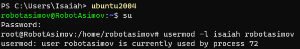
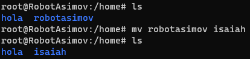
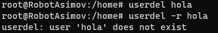

# **CHANGE USERNAME IN  WSL UBUNTU 20.04** 

In <u>*PowerShell*</u>, type 

```
C:>         ubuntu2004
~           su
Password:
#           usermod -l <newUsername> <oldUsername>
```


But happens *"... is currently used by process #"*

So we create a temp user by:

````
sudo adduser <username>
...(Password and all that stuff)
exit
````

And change the default user to avoid any process with the desired user:

````
ubuntu2004 config --default-user <username>
````

So now you'll be avaible to use the usermod command

<br>

---

<br>

## **Delete temp user and renaming directory**

<br>

You already changed the username, but directory keep naming as the old one so simply use `mv` command. But it may produce some errors due to configuration has its path in /robotasimov



And for deleting temp user use `userdel` command



`userdel -r` is supposed to delete *temp user* directory too. Or you can remove it by `rm -r` command

---

<br>

### **BONUS:** Granting Admin Rights via Command Line

<br>

`sudo usermod -aG sudo <username>`

<br>

The `-aG` flag stands for **Append and Group**. This command instructs `usermod` to append the username to a group, which in this case is the sudo group.
